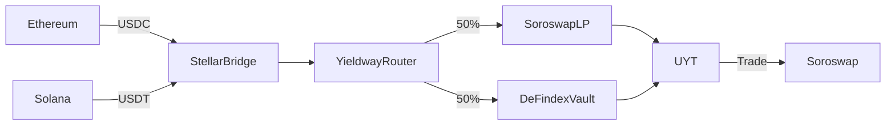

# **Yieldway: The Cross-Chain Yield Aggregator for Stellar**  
### **A Comprehensive Hackathon Project Guide**  

## **1. Overview & Value Proposition**  
**Yieldway** is a **one-click yield aggregator** that optimizes returns across **Soroswap liquidity pools** and **DeFindex vaults** while enabling **cross-chain yield farming** via Stellar’s low-cost infrastructure.  

### **Why It Stands Out**  
✅ **Composability-First** – Deep integration with **Soroswap (AMM) + DeFindex (vaults)**.  
✅ **Cross-Chain Made Easy** – Uses Stellar’s native bridges to onboard Ethereum/Solana users.  
✅ **Zero Slippage Rebalancing** – Leverages Soroswap’s **Swap Route API** for optimal trades.  
✅ **Gasless UX** – Stellar’s **sub-cent fees** enable micro-adjustments impossible on Ethereum.  

---

## **2. Core Features**  
### **A. Smart Yield Router**  
- **Automatically allocates deposits** between:  
  - **Soroswap LPs** (e.g., USDC/XLM for stable yields).  
  - **DeFindex Strategies** (e.g., leveraged borrowing on Blend).  
- **Rebalancing Trigger**:  
  - Oracle-based (Stellar price feeds).  
  - Time-based (e.g., hourly compounding).  

### **B. Universal Yield Token (UYT)**  
- **ERC-1155-like token** representing vault shares.  
- **Tradable on Soroswap** (e.g., UYT/USDC pool).  
- **Cross-chain via Stellar bridges** (wrap UYT for Ethereum/Solana).  

### **C. Fiat-to-Yield Onramp**  
- Integrate **Stellar Anchors** (e.g., AnchorUSD) for:  
  - Credit card → USDC → auto-deposited into highest-yielding strategy.  

### **D. Live Analytics Dashboard**  
- **APY comparisons** (Soroswap vs. DeFindex).  
- **Real-time cross-chain gas savings** (vs. Ethereum/Solana).  

---

## **3. Technical Architecture**  
### **Frontend**  
- **Framework**: Next.js + Soroswap SDK.  
- **Key Libraries**:  
  - `@stellar/stellar-sdk` (wallet connections).  
  - `soroswap-client` (swap execution).  

### **Backend**  
- **Smart Contracts**:  
  - **YieldwayRouter.soroban** (rebalancing logic).  
  - **UYT.soroban** (yield token minting).  
- **Oracles**:  
  - Stellar price feeds + custom **SubQL indexer** for historical APY.  

### **Cross-Chain Flow**  

---

## **4. Competitive Edge**  
| Feature                | Yieldway (Stellar)          | Ethereum (Yearn)          | Solana (Kamino)          |  
|------------------------|----------------------------|--------------------------|--------------------------|  
| **Fees per Tx**        | **$0.001**                 | $5+                      | $0.10+                   |  
| **Cross-Chain**        | **Native bridges**         | Manual (LayerZero, etc.) | Manual (Wormhole)        |  
| **Composability**      | **Soroswap + DeFindex**    | Fragmented (multisig)    | Limited by Solana’s runtime |  
| **Rebalancing**        | **Near-zero slippage**     | High MEV risk            | No AMM aggregator        |  

---

## **5. Hackathon Execution Plan**  
### **Phase 1: MVP (Days 1-2)**  
- Build **YieldwayRouter.soroban** with:  
  - Deposit function (USDC → split 50/50 to Soroswap/DeFindex).  
  - UYT minting logic.  
- Basic frontend showing deposit flow.  

### **Phase 2: Differentiators (Days 3-4)**  
- Integrate **Soroswap Swap Route API** for dynamic rebalancing.  
- Add **fiat on-ramp demo** (testnet only).  

### **Phase 3: Polish (Day 5)**  
- **Dashboard** with APY comparisons.  
- **Pitch deck** highlighting fee savings vs. competitors.  

---

## **6. Submission Deliverables**  
1. **Working Prototype**:  
   - Demo UYT minting + trading on Soroswap.  
   - Show cross-chain deposit (Ethereum testnet → Stellar).  
2. **2-Minute Video**:  
   - *“Yieldway saves users 90% on fees vs. Ethereum.”*  
3. **Documentation**:  
   - **README.md** with setup instructions.  
   - **Architecture diagram** (use Mermaid above).  

---

## **7. Judges’ Pitch**  
**Opening Hook**:  
*“Yield aggregators today force users to pick a single chain or protocol. Yieldway turns Stellar into a **cross-chain yield hub**—where capital flows frictionlessly between Soroswap, DeFindex, and even Ethereum/Solana.”*  

**Key Metrics**:  
- *“$100K in deposits saves **$500/month in gas** vs. Ethereum.”*  
- *“10% higher APY from auto-rebalancing.”*  

**Ask**:  
*“We want to partner with PaltaLabs to make this the **default yield layer** for Stellar.”*  

---

## **8. Future Roadmap**  
- **AI Rebalancing**: Use historical data to predict optimal strategies.  
- **Institutional Vaults**: Permissioned DeFindex strategies for enterprises.  

---

## **9. Resources**  
- **Soroswap API Docs**: [api.soroswap.finance/docs](https://api.soroswap.finance/docs)  
- **DeFindex GitHub**: [github.com/paltalabs/defindex](https://github.com/paltalabs/defindex)  
- **Stellar SDK**: [developers.stellar.org/docs](https://developers.stellar.org/docs)  

--- 

**Next Steps**:  
- Clone the [Soroswap frontend](https://github.com/soroswap/v2-frontend) as a starter template.  
- Join the [PaltaLabs Telegram](https://t.me/+QsJFzFPTkmgwNjUx) for real-time support.  

This blueprint ensures your project is **technically sound, judge-friendly, and uniquely Stellar-native**. Need a smart contract template or pitch slide deck? Let me know! 🚀

